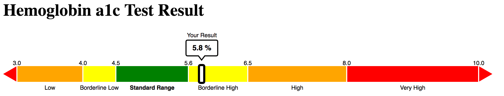
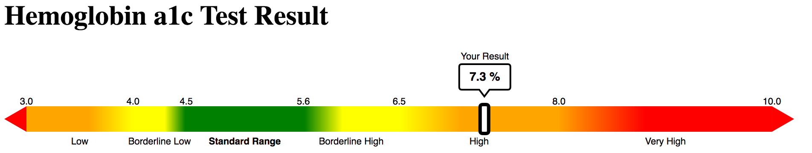

# Test Result Graphics

This module will produce graphics that can help patients understand their test results. This module produces a specification object that can be passed to [Vega](https://vega.github.io/vega/) in order to produce a graphic.

The design of these graphics has undergone extensive research to establish their efficacy. More information about these graphics can be found at [http://mylabresults.org](http://mylabresults.org).

# Usage

This module produces a formatted object that can be passed to any of [Vega's](https://vega.github.io/vega/) methods for viewing a visualization. Please refer to the [Vega Documenation](https://vega.github.io/vega/usage/) for more information about calling Vega and using it in web pages.

To produce a graphic, you must first create a specification, which is then passed to Vega. You must specify several parameters for the graphic. These parameters are :

| name | description |
| ---- | ----------- |
| result | *required*   The numeric value of the test result |
| units | *required*   A string indicating the test units (e.g. '%' or 'mg/dL')|
| ticks | *required*   An array of points on the number line that delineate different ranges. E.g. `[3, 4, 4.5, 5.6, 6.5, 8, 10]`. A tick mark and label will appear at each of these points. These points also identify the borders for different colors on the number line |
| colors | *required*   An array of colors, in hexidecimal format or predefined color names, to fill the space between each tick point. E.g. `["orange", "yellow", "green", "yellow", "orange", "#FF0222"]`. This array should have a length of ticks.length - 1 so that each gap between ticks has a fill identified |
| standard | *required*   An array of two points that indicate the low and high points in the test's "standard range." E.g. `[4.5, 5.6]` |
| labels | An array of labels for the ranges between tick points. E.g. `["Low", "Borderline Low", "Standard Range", "Borderline High", "High", "Very High"]`. |
| decimals | The number of decimal points to show on labels *(default is 1)* |
| gradient | A boolean indicating whether the graph should use gradients. If gradients are used, the full width of the standard range is shown in the solid color indicated in the colors array. Then, a gradient extends in each direction and ends at the point that is 40% of the way to the next tick mark, where a new gradient begins. |
| endCaps | An array of two hexidecimal colors to fill the arrows on each end of the number line. E.g. `["orange, #FF0222"]`. The default value is `["transparent", "transparent"]` which hide both arrows |
| height | The height in pixels of the whole graphic. Default is 100 |
| width | The width in pixels of the whole graphic. Default is 900 |

Create an object with the required parameters and any optional parameters, then pass if to the TestResultOptions() function to build a full set of parameters :

``` javascript
var opts = {
    "result": 6,
    "units": "%",
    "ticks": [3, 4, 4.5, 5.6, 6.5, 8, 10],
    ...
};
var optsObject = new TestResultOptions(opts);
```

`optsObject` can then be used to create a new Vega json specification for the graphic.

``` javascript
var spec = new TestResultSpec.buildSpec(optsObject);
```

With the `spec` object you can use Vega to build the graphic. For example, using the Vega View API:

``` javascript
var view = new vega.View(vega.parse(spec))
      .renderer('svg')  // set renderer (canvas or svg)
      .initialize('#view') // initialize view within parent DOM container
      .hover()             // enable hover encode set processing
      .run();
```

This will insert the graphic into the specified element (e.g. "#view" in this example) on your page.

## A Complete Example

This example will produce a graphic visualizing a patient's Hemoglobin A1c result.


``` html
<html>
    <head>
        <script src="vega.min.js"></script>
        <script src="testresults.js"></script>
    </head>
    <body>
        <h1>Hemoglobin a1c Test Result</h1>
        <div id="view"></div>
        <script>
        var opts = {
            "result": 5.8,
            "units": "%",
            "ticks": [3, 4, 4.5, 5.6, 6.5, 8, 10],
            "colors": ["orange", "yellow", "green", "yellow", "orange", "red"],
            "standard": [4.5, 5.6],
            "labels": ["Low", "Borderline Low", "Standard Range", "Borderline High", "High", "Very High"],
            "endCaps": ["red", "red"],
            "gradient":false,
            "decimals": 1
        };

        var s = new TestResultOptions(opts);
        var spec = new TestResultSpec(s).buildSpec();

        var view = new vega.View(vega.parse(spec))
              .renderer('svg')
              .initialize('#view')
              .hover()
              .run();
        </script>

    </body>
</html>
```

This code produces the following:


## Pre-set test parameters
As described at [http://mylabresults.org/about](mylabresults.org), these graphics are part of a research project to help patients understand their test results. We have developed some parameters for a small set of tests, and these are available in the `test_types` directory as json file. **DISCLAIMER** All information provided by MyLabResults.org and in this repository, including the standard ranges, categories, and labels used in the displays, should NOT be taken as medical advice or verified medical data of any kind. The categories and numbers used in these graphics have only been reviewed by a few doctors and cannot be interpreted to represent the consensus judgment of the medical community.

To use these pre-set parameters for a specific type of test, load one of the files into your script as a variable using your preferred method (the example below uses jQuery and ajax), add a result property and value, then create the TestResultOptions object. You can also adjust any other properties as needed, such as using a gradient.

``` html
<body>
    <h1>Hemoglobin a1c Test Result</h1>
    <div id="view">

    </div>
    <script>

    var a1c = (function () {
        var json = null;
        $.ajax({
            'async': false,
            'global': false,
            'url': 'test_types/a1c.json',
            'dataType': "json",
            'success': function (data) {
                json = data;
            }
        });
        return json;
    })();
    a1c.result = 7.3;
    a1c.gradient = true;

    var s = new TestResultOptions(a1c);
    var spec = new TestResultSpec(s).buildSpec();

    var view = new vega.View(vega.parse(spec))
          .renderer('svg')
          .initialize('#view')
          .hover()
          .run();
    </script>
</body>
</html>
```
This produces the following:

